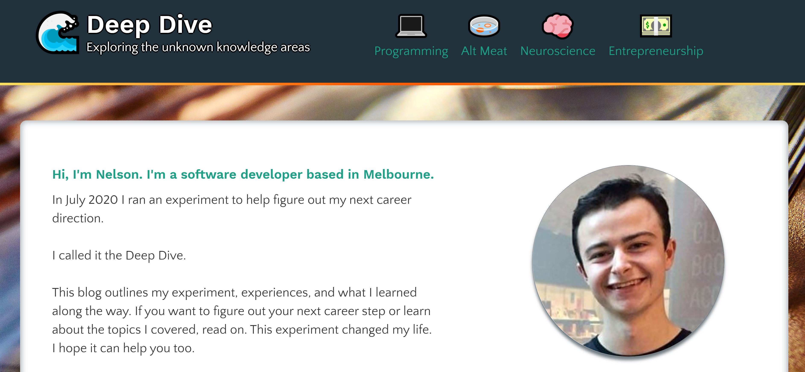

# :ocean: Deep Dive :ocean:

## Exploring Unknown Knowledge Areas

https://inspiring-bhabha-1701fc.netlify.app/

Created by Nelson Gardner-Challis (@NelsonG-C)

## Project Overview

A GatsbyJS that outlines a career planning challenge that I completed in July 2020. I ran this experiment to help determine my next major career direction.

I created this project with the following:
* GatsbyJS
* React
* JavaScript
* GraphQL

The website is hosted with Netlify and uses Netlify CMS.

## Feedback welcome!

If you have any thoughts about the project, or suggestions to add, you can [file it as an issue](https://github.com/NelsonG-C/deep_dive_blog/issues) here. Thanks!

<!-- AUTO-GENERATED-CONTENT:END -->
